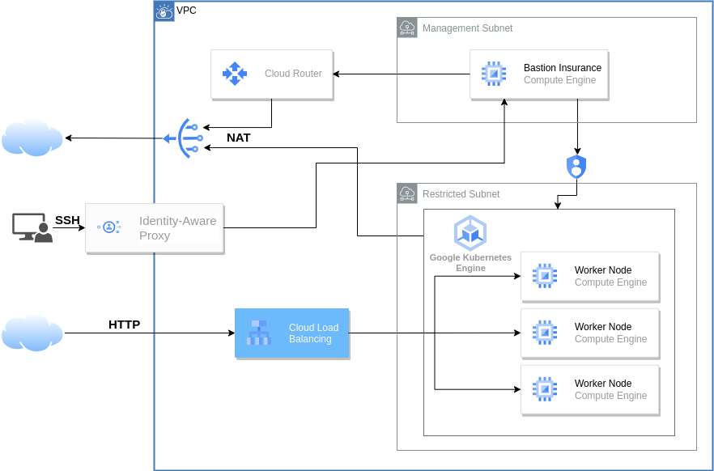

# ITI Final project

## Tools used

- ### Jenkins
- ### Docker
- ### Terraform
- ### Google Cloud Platform
- ### Kubernetes

## Here's my Infrastructure Diagram



## Create and Push Docker Image

### create dockerfile

[./Dockerfile](Dockerfile)
<br>

### build image form dockerfile
>$ docker build -t kerolosayad/jenkins-k8s .
<br>


### Push image to dockerhub


>$ docker push kerolosayad/jenkins-k8s


<br>
<br>

## Now for the Terraform part

### enable storage buckets API
for terraform to use your credientials for API calls
>$ gcloud auth application-default login

enable storage API
>$ gcloud services enable storage.googleapis.com

### Create storge bucket for terraform backend

./state-storge-bucket/main.tf

```
provider "google" {
  project = "ancient-jigsaw-366112"
  region     = "us-central1"
}

resource "random_id" "bucket_prefix" {
  byte_length = 8
}

resource "google_storage_bucket" "state-storge-bucket" {
  name          = "${random_id.bucket_prefix.hex}-bucket-tfstate"
  force_destroy = false
  location      = "US"
  storage_class = "STANDARD"
  versioning {
    enabled = true
  }
}
```

>$ terraform init

>$ terraform apply


### Create terraform project
make new directory for the terraform project


[./terraform](terraform)

to store the terraform state file in our backend storge bucket

[./terraform/backend.tf](terraform/backend.tf)

```
terraform {
 backend "gcs" {
   bucket  = "ca722bb262a23d93-bucket-tfstate" # storge bucket id
   prefix  = "terraform/state"
 }
}
```

>$ terraform init

### copy files in [./terraform](terraform)

>$ terraform apply --var-file prod.tfvars

### results:
- vpc
- subnets
  
- router
  
- nat-gateway
  
- instance
  
- firewall
  
- google_container_cluster
  
- container_node_pool
  

## Connect to cluster

### ssh to private VM

>$ gcloud compute ssh --zone "us-central1-a" "management-vm"  --tunnel-through-iap --project "ancient-jigsaw-366112"


### login
>$ gcloud auth login
### connect to cluster
Install the gke-gcloud-auth-plugin
>$ sudo apt-get install google-cloud-sdk-gke-gcloud-auth-plugin

### install kubctl
>$ apt-get update

>$ apt-get install -y kubectl

>$ kubectl version --short --client


Now connect kubectl to the cluster

>$ gcloud container clusters get-credentials gke-cluster --region us-central1 --project ancient-jigsaw-366112


Test kubectl

>$ kubectl get nodes


### Deploy Jenkins

>$ kubectl apply -f jenkins-deploy.yml

>$ kubectl apply -f jenkins-svc.yml


